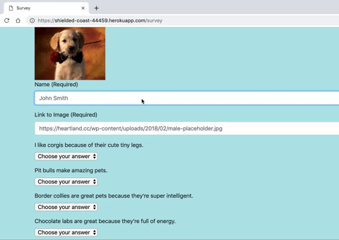
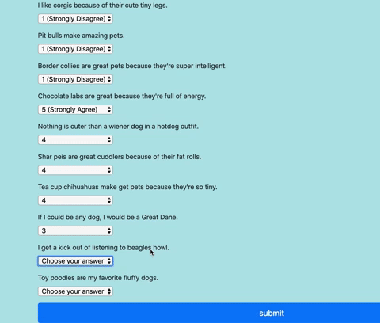

# friendfinder

### About the Application
This application utilizes express.js, routing, and a server to help individuals find others with similar interests related to dogs. 

### Using the Application
Users will answer a series of 10 questions ranking their agreement with each response from 1 (strongly disagree) to 5 (strongly agree).

Upon answering all questions, users will be shown the name and photo of a previous survey responder whose answers most closely match their own. 

